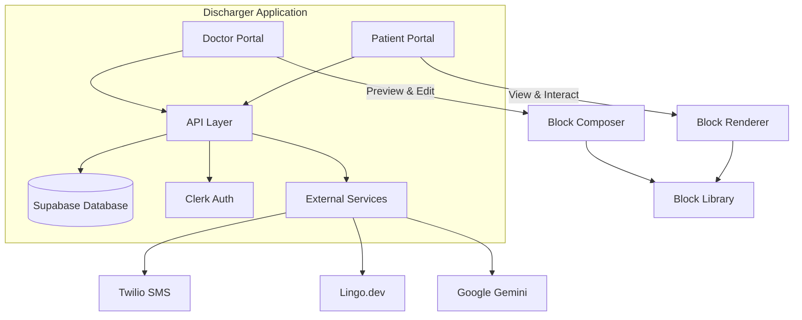
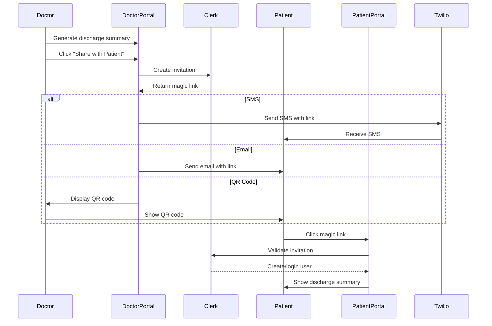
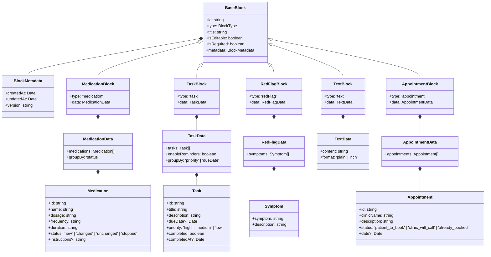
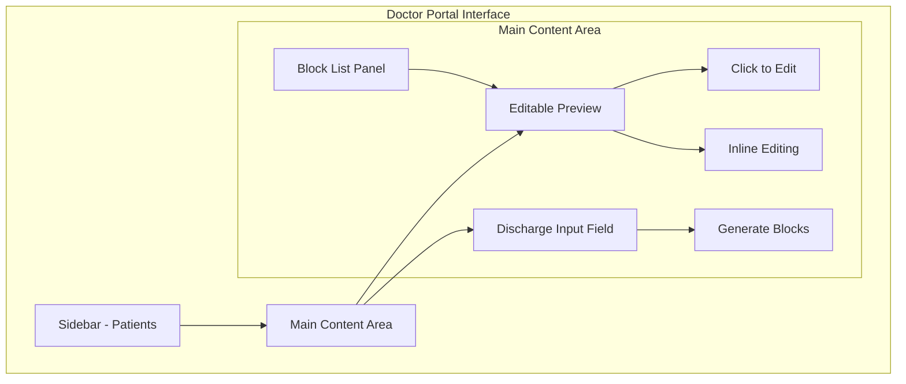

# Product Requirements Document: Patient Portal Extension for Discharger

## Executive Summary

This PRD outlines the implementation plan for extending the existing Discharger application to include a patient-facing portal. The extension will enable doctors to share simplified, interactive discharge summaries with patients via Clerks magic link authentication, providing a mobile-optimized experience for patients to track their recovery tasks, medications, and follow-up appointments.

## Product Vision

Transform complex medical discharge summaries into accessible, interactive patient guides that improve health outcomes through better patient understanding and engagement with their post-discharge care plans.

## Architecture Overview

### System Architecture



### Authentication Flow



## Block-Based Architecture

### Core Concept

The patient portal will use a **composable block system** where each section of the discharge summary is a reusable, configurable block. This allows for:
- Future extensibility to GP practices and other healthcare contexts
- Doctor customization of discharge summary layouts
- AI-assisted block composition
- Consistent UI/UX across different medical contexts

### Block Architecture



### Block Type Definitions

export type BlockType = 'text' | 'medication' | 'task' | 'redFlag' | 'appointment';

export type BaseBlock = {
  id: string;
  type: BlockType;
  title: string;
  isEditable: boolean;
  isRequired: boolean;
  metadata: {
    createdAt: Date;
    updatedAt: Date;
    version: string;
  };
};

export type TextBlock = {
  type: 'text';
  data: {
    content: string;
    format: 'plain' | 'rich';
  };
} & BaseBlock;

export type MedicationBlock = {
  type: 'medication';
  data: {
    medications: Array<{
      id: string;
      name: string;
      dosage: string;
      frequency: string;
      duration: string;
      status: 'new' | 'changed' | 'unchanged' | 'stopped';
      instructions?: string;
    }>;
    groupBy: 'status';
  };
} & BaseBlock;

export type TaskBlock = {
  type: 'task';
  data: {
    tasks: Array<{
      id: string;
      title: string;
      description: string;
      dueDate?: Date;
      priority: 'high' | 'medium' | 'low';
      completed: boolean;
      completedAt?: Date;
    }>;
    enableReminders: boolean;
    groupBy: 'priority' | 'dueDate';
  };
} & BaseBlock;

export type RedFlagBlock = {
  type: 'redFlag';
  data: {
    symptoms: Array<{
      symptom: string;
      description: string;
    }>;
  };
} & BaseBlock;

export type AppointmentBlock = {
  type: 'appointment';
  data: {
    appointments: Array<{
      id: string;
      clinicName: string;
      description: string;
      status: 'patient_to_book' | 'clinic_will_call' | 'already_booked';
      date?: Date;
    }>;
  };
} & BaseBlock;

// Block registry for extensibility
const BlockRegistry = {
  medication: MedicationBlock,
  task: TaskBlock,
  redFlag: RedFlagBlock,
  text: TextBlock,
  appointment: AppointmentBlock,
  // Future blocks can be added here
};
```

## Database Schema

### Updated Schema with Block Architecture

```sql
-- Patient discharge summaries with Clerk integration
CREATE TABLE patient_summaries (
  id UUID PRIMARY KEY DEFAULT uuid_generate_v4(),
  patient_id UUID REFERENCES patients(id) ON DELETE CASCADE,
  doctor_id UUID REFERENCES user_profiles(id),
  
  -- Clerk invitation/user tracking
  clerk_invitation_id VARCHAR(255),
  clerk_user_id VARCHAR(255),
  patient_email VARCHAR(255),
  patient_phone VARCHAR(20),
  
  -- Block-based discharge data
  blocks JSONB NOT NULL, -- Array of block configurations
  template_id UUID REFERENCES discharge_templates(id), -- Optional template reference
  
  -- Multi-language support
  language_preference VARCHAR(10) DEFAULT 'en',
  translations JSONB DEFAULT '{}', -- Cached translations
  
  -- Tracking
  created_at TIMESTAMP WITH TIME ZONE DEFAULT NOW(),
  published_at TIMESTAMP WITH TIME ZONE,
  last_accessed_at TIMESTAMP WITH TIME ZONE,
  access_count INTEGER DEFAULT 0,
  
  -- Status
  status VARCHAR(20) DEFAULT 'draft' CHECK (status IN ('draft', 'published', 'archived')),
  shared_via VARCHAR(10) CHECK (shared_via IN ('email', 'sms', 'qr'))
);

-- Block templates for reusability
CREATE TABLE discharge_templates (
  id UUID PRIMARY KEY DEFAULT uuid_generate_v4(),
  name VARCHAR(255) NOT NULL,
  description TEXT,
  blocks JSONB NOT NULL, -- Default block configuration
  specialty VARCHAR(100), -- e.g., 'orthopedics', 'cardiology'
  is_public BOOLEAN DEFAULT false,
  created_by UUID REFERENCES user_profiles(id),
  created_at TIMESTAMP WITH TIME ZONE DEFAULT NOW()
);

-- Block presets for quick insertion
CREATE TABLE block_presets (
  id UUID PRIMARY KEY DEFAULT uuid_generate_v4(),
  block_type VARCHAR(50) NOT NULL,
  name VARCHAR(255) NOT NULL,
  configuration JSONB NOT NULL,
  tags TEXT[],
  created_by UUID REFERENCES user_profiles(id),
  is_public BOOLEAN DEFAULT false
);

-- Track block-level interactions
CREATE TABLE block_interactions (
  id UUID PRIMARY KEY DEFAULT uuid_generate_v4(),
  summary_id UUID REFERENCES patient_summaries(id) ON DELETE CASCADE,
  block_id VARCHAR(255) NOT NULL,
  interaction_type VARCHAR(50), -- 'task_completed', 'medication_viewed', etc.
  data JSONB,
  created_at TIMESTAMP WITH TIME ZONE DEFAULT NOW()
);
```

## Implementation Stages

### Stage 1: Foundation & Block System

#### 1.1 Block Architecture Implementation
- [X] Create base block interface and abstract class (`src/types/blocks.ts`)
- [ ] Implement block registry system
- [X] Build block validation framework (Zod schemas in types)
- [X] Create block rendering engine
- [X] Implement block state management (Zustand stores)

#### 1.2 Core Block Components
- [X] Build MedicationBlock component (`src/components/blocks/MedicationBlock.tsx`)
- [X] Build TaskBlock component with progress tracking (`src/components/blocks/TaskBlock.tsx`)
- [X] Build RedFlagBlock with emergency UI (`src/components/blocks/RedFlagBlock.tsx`)
- [ ] Build TextBlock with rich text support
- [X] Build AppointmentBlock with calendar integration (`src/components/blocks/AppointmentBlock.tsx`)

#### 1.3 Database Implementation
- [X] Create block-based schema tables (patient_summaries)
- [ ] Implement block versioning system
- [ ] Create template management tables
- [ ] Set up block interaction tracking
- [X] Configure RLS policies for patient access

### Stage 2: Doctor Portal Enhancements

#### 2.1 Doctor Portal Layout



Layout Structure:
```
┌─────────┬──────────────────────────────────────┬──────────────┐
│         │        Editable Preview              │              │
│ Sidebar │   ┌─────────────────────────┐       │  Block List  │
│         │   │  📋 Summary              │       │              │
│ Patients│   │  Click to edit text...   │       │  [Summary]   │
│ Settings│   ├─────────────────────────┤       │  [Tasks]     │
│         │   │  ✓ Tasks                 │       │  [Meds]      │
│         │   │  1. Follow up with GP    │       │  [Red Flags] │
│         │   │  2. Blood test Tuesday   │       │  [+ Add]     │
│         │   ├─────────────────────────┤       │              │
│         │   │  💊 Medications          │       │              │
│         │   │  • Paracetamol 500mg     │       │              │
│         │   └─────────────────────────┘       │              │
│         │                                       │              │
│         │   [Paste discharge summary below]    │              │
│         │   ┌─────────────────────────┐       │              │
│         │   │                         │       │              │
│         │   │                         │       │              │
│         │   └─────────────────────────┘       │              │
│         │   [Generate]                         │              │
└─────────┴──────────────────────────────────────┴──────────────┘
```

#### 2.2 Editable Preview Component

- [X] Create EditablePreview component with direct editing
- [X] Implement inline editing for each block type
- [ ] Add block reordering (future phase)
  - Drag handles on hover
  - Smooth animation on reorder
  - Keyboard shortcuts for moving blocks

- [ ] Create block library sidebar
  - List of available block types
  - Search/filter functionality
  - Drag to add (future)
  - Quick add buttons

#### 2.3 Discharge Input Integration

- [X] Create separate discharge input field below preview
- [X] Update LLM prompts to output block format:
  ```typescript
  interface LLMBlockOutput {
    blocks: Array<{
      type: BlockType;
      title: string;
      data: any;
    }>;
    metadata: {
      patientName?: string;
      dischargeDate?: string;
      primaryDiagnosis?: string;
    };
  }
  ```
- [X] Implement smart block generation from discharge text
- [X] Add block validation post-generation
- [ ] Create block merge logic for combining with existing blocks

#### 2.4 Interactive Editing Features

- [X] Implement direct text editing within blocks
- [ ] Add rich text editing for text blocks
- [ ] Create hover states showing editability
- [ ] Add auto-save with debouncing
- [ ] Implement undo/redo functionality

#### 2.5 Future: Mobile Preview Mode

- [X] Add toggle between "Edit Mode" and "Preview Mode"
- [X] Preview mode shows mobile-styled render
- [X] Edit mode shows current editable interface
- [X] Implement responsive preview sizing options

### Stage 3: Patient Portal Core

#### 3.1 Authentication Setup
- [ ] Configure Clerk for patient users
- [ ] Create patient-specific auth middleware
- [ ] Build magic link landing page
- [ ] Implement auto-login flow
- [ ] Add session management

#### 3.2 Block Renderer System
- [X] Create PatientLayout component
- [X] Implement block-specific patient views
- [ ] Add interaction tracking hooks
- [X] Build responsive mobile layouts
- [ ] Create offline-capable rendering

#### 3.3 Progressive Web App Setup
- [ ] Configure PWA manifest
- [ ] Implement service worker
- [ ] Add install prompt
- [ ] Create offline fallbacks
- [ ] Build update notifications

### Stage 4: Interactive Features

#### 4.1 Task Management System
- [X] Create task completion UI
- [ ] Implement progress persistence
- [ ] Add task reminders
- [ ] Build streak tracking
- [ ] Create motivational feedback

#### 4.2 Medication Tracking
- [X] Build medication checklist
- [ ] Add medication info links

#### 4.3 Multi-language Support with Lingo.dev
- [ ] Integrate Lingo.dev SDK
- [ ] Configure supported languages
- [ ] Create language switcher
- [ ] Implement dynamic translation:
- [ ] Add RTL layout support
- [ ] Cache translations locally

### Stage 5: Advanced Features

#### 4.1 AI Chat Assistant
- [ ] Design chat interface within patient portal
- [ ] Create chat API with block context:
  ```typescript
  // Chat context includes all blocks
  const chatContext = {
    blocks: patientSummary.blocks,
    language: patient.language,
    completedTasks: patient.taskProgress,
    medications: patient.medications
  };
  ```
- [ ] Implement conversation memory
- [ ] Add suggested questions
- [ ] Build escalation to doctor

#### 4.2 Analytics & Tracking
- [ ] Implement PostHog for patient portal
- [ ] Track block interactions
- [ ] Monitor task completion rates
- [ ] Analyze chat usage patterns
- [ ] Create doctor dashboard for insights

### Stage 6: Polish & Optimization

#### 6.1 Performance
- [ ] Implement block lazy loading
- [ ] Add virtual scrolling for long summaries
- [ ] Optimize bundle splitting
- [ ] Create CDN strategy
- [ ] Implement aggressive caching

#### 6.2 Accessibility
- [ ] Add ARIA labels to all blocks
- [ ] Implement keyboard navigation
- [ ] Create high contrast mode
- [ ] Add screen reader support
- [ ] Build voice control options

## API Design

### Block Management APIs

```typescript
// Block template CRUD
GET    /api/block-templates
POST   /api/block-templates
PUT    /api/block-templates/:id
DELETE /api/block-templates/:id

// Block preset management
GET    /api/block-presets?type={blockType}
POST   /api/block-presets

// AI block suggestions
POST   /api/blocks/suggest
{
  context: string;
  patientInfo: PatientInfo;
  specialty?: string;
}

// Block interaction tracking
POST   /api/blocks/interactions
{
  summaryId: string;
  blockId: string;
  interactionType: string;
  data: any;
}
```

### Patient Portal APIs

```typescript
// Get patient summary with blocks
GET    /api/patient/summary/:summaryId

// Update block interaction (task completion, etc.)
POST   /api/patient/blocks/:blockId/interact

// Patient preferences
PATCH  /api/patient/preferences

// Chat with context
POST   /api/patient/chat
```

## Technical Considerations

### Block Rendering Strategy

```typescript
// Block renderer factory
const BlockRendererFactory = {
  renderBlock(block: BaseBlock, mode: 'edit' | 'preview' | 'patient') {
    const Component = BlockRegistry[block.type];
    if (!Component) {
      console.error(`Unknown block type: ${block.type}`);
      return null;
    }
    
    return (
      <Component
        block={block}
        mode={mode}
        key={block.id}
      />
    );
  }
};

// Usage in patient portal
const PatientSummaryView = ({ blocks }) => {
  return (
    <div className="space-y-4">
      {blocks
        .sort((a, b) => a.order - b.order)
        .map(block => BlockRendererFactory.renderBlock(block, 'patient'))
      }
    </div>
  );
};
```

### State Management Extension

```typescript
// Extend discharge summary store
interface DischargeSummaryStore {
  // Existing fields...
  
  // Block management
  blocks: BaseBlock[];
  selectedBlockId: string | null;
  blockTemplates: BlockTemplate[];
  
  // Actions
  addBlock: (blockType: BlockType, afterId?: string) => void;
  updateBlock: (blockId: string, updates: Partial<BaseBlock>) => void;
  removeBlock: (blockId: string) => void;
  reorderBlocks: (blockIds: string[]) => void;
  loadTemplate: (templateId: string) => void;
  saveAsTemplate: (name: string) => void;
}
```

## Security & Compliance

### Clerk Integration Security
- Use Clerk's built-in security features
- Implement invitation expiration (24 hours)
- Add rate limiting on invitation creation
- Log all invitation activities
- Enable Clerk's bot protection

### Data Protection with Blocks
- Encrypt block data at rest
- Implement field-level permissions
- Add audit trail for block modifications
- Create data retention policies per block type
- Enable HIPAA-compliant logging

## Success Metrics

### Block System Metrics
- Block type usage distribution
- Custom template creation rate
- Block modification frequency
- AI suggestion acceptance rate

### Patient Engagement Metrics
- Invitation redemption rate
- Block interaction rates by type
- Task completion percentage
- Language preference distribution
- Chat engagement per block type

## Development Guidelines

### Block Development Checklist
- [ ] Define block TypeScript interface
- [ ] Create doctor editing component
- [ ] Create patient viewing component
- [ ] Add block to registry
- [ ] Implement validation rules
- [ ] Add to block library UI
- [ ] Create preset examples
- [ ] Add translations
- [ ] Write tests
- [ ] Document usage

## Future Considerations

### Block Ecosystem
- Community block marketplace
- Third-party block development
- Block version compatibility
- Cross-institution block sharing
- Block analytics and insights

### AI Enhancement
- Smart block recommendations based on patient condition
- Auto-arrangement based on health literacy
- Predictive block content generation
- Natural language to block conversion

## Conclusion

This PRD outlines a flexible, extensible architecture for the patient portal that prioritizes reusability through a block-based system. By using Clerks invitation system for authentication and building with composable blocks, the platform can easily extend to GP practices and other healthcare contexts while maintaining a consistent, high-quality patient experience.

## Current File Structure

```
src/
├── README.md
├── api/
│   ├── blocks/
│   │   ├── hooks.ts
│   │   └── queries.ts
│   ├── discharge/
│   │   ├── hooks.ts
│   │   └── queries.ts
│   ├── documents/
│   │   ├── hooks.ts
│   │   ├── queries.ts
│   │   └── types.ts
│   ├── hospitals/
│   │   └── queries.ts
│   ├── index.ts
│   ├── patient-summaries/
│   │   ├── hooks.ts
│   │   ├── queries.ts
│   │   └── types.ts
│   ├── patients/
│   │   ├── hooks.ts
│   │   ├── queries.ts
│   │   └── types.ts
│   ├── snippets/
│   │   ├── hooks.ts
│   │   ├── queries.ts
│   │   └── types.ts
│   └── users/
│       ├── hooks.ts
│       ├── queries.ts
│       └── types.ts
├── app/
│   ├── (auth)/
│   │   ├── (center)/
│   │   │   ├── layout.tsx
│   │   │   ├── sign-in/
│   │   │   │   └── [[...sign-in]]/
│   │   │   │       └── page.tsx
│   │   │   └── sign-up/
│   │   │       └── [[...sign-up]]/
│   │   │           └── page.tsx
│   │   ├── (sidebar)/
│   │   │   ├── admin/
│   │   │   │   └── page.tsx
│   │   │   ├── composer/
│   │   │   │   └── page.tsx
│   │   │   ├── dev/
│   │   │   │   └── page.tsx
│   │   │   ├── layout.tsx
│   │   │   ├── memory/
│   │   │   │   ├── columns.tsx
│   │   │   │   └── page.tsx
│   │   │   ├── page.tsx
│   │   │   ├── profile/
│   │   │   │   └── page.tsx
│   │   │   └── snippets/
│   │   │       └── page.tsx
│   │   └── layout.tsx
│   ├── api/
│   │   ├── blocks/
│   │   │   └── generate/
│   │   │       └── route.ts
│   │   ├── dev/
│   │   │   ├── seed-hospitals/
│   │   │   │   └── route.ts
│   │   │   └── seed-user-data/
│   │   │       └── route.ts
│   │   ├── discharge/
│   │   │   └── route.ts
│   │   ├── documents/
│   │   │   ├── [id]/
│   │   │   │   ├── route.ts
│   │   │   │   └── signed-url/
│   │   │   │       └── route.ts
│   │   │   └── route.ts
│   │   ├── hospitals/
│   │   │   └── route.ts
│   │   ├── patient-summaries/
│   │   │   ├── [id]/
│   │   │   │   ├── blocks/
│   │   │   │   │   └── route.ts
│   │   │   │   └── route.ts
│   │   │   └── route.ts
│   │   ├── patients/
│   │   │   ├── [id]/
│   │   │   │   └── route.ts
│   │   │   ├── cleanup/
│   │   │   │   └── route.ts
│   │   │   └── route.ts
│   │   ├── snippets/
│   │   │   ├── [id]/
│   │   │   │   └── route.ts
│   │   │   ├── route.ts
│   │   │   └── shortcut/
│   │   │       └── [shortcut]/
│   │   │           └── route.ts
│   │   ├── users/
│   │   │   ├── preferences/
│   │   │   │   └── route.ts
│   │   │   └── profile/
│   │   │       └── route.ts
│   │   └── webhooks/
│   │       └── clerk/
│   │           └── route.ts
│   ├── docs/
│   │   ├── PRD.md
│   │   ├── block-generation-implementation-plan.md
│   │   ├── deployment-readiness-plan.md
│   │   ├── discharge-implementation-plan.md
│   │   ├── informal-PRD.md
│   │   ├── lingo-dev-implementation-guide.md
│   │   ├── onborda-implementation-guide.md
│   │   ├── patient-lifecycle-refactor.md
│   │   ├── patient-portal-implementation-plan.md
│   │   └── patient-simplifier
│   ├── global-error.tsx
│   ├── layout.tsx
│   ├── patient/
│   │   ├── [summaryId]/
│   │   │   └── page.tsx
│   │   └── layout.tsx
│   ├── robots.ts
│   └── sitemap.ts
├── components/
│   ├── AutoSaveIndicator.tsx
│   ├── ContextViewer/
│   │   ├── ContextViewer.tsx
│   │   ├── ContextViewerHeader.tsx
│   │   ├── DocumentListPanel.tsx
│   │   ├── UserContextPanel.tsx
│   │   └── index.ts
│   ├── DataTable.tsx
│   ├── DevicePreviewer/
│   │   ├── DevicePreview.tsx
│   │   ├── device-styles.module.css
│   │   ├── iPhone14Frame.tsx
│   │   └── index.ts
│   ├── DischargeSummary.tsx
│   ├── DischargeSummary/
│   │   ├── DischargeSummaryContent.tsx
│   │   ├── DischargeSummaryHeader.tsx
│   │   ├── DischargeSummaryPanel.tsx
│   │   ├── DischargeSummarySection.tsx
│   │   ├── FeedbackInput.tsx
│   │   └── index.ts
│   ├── DocumentPreviewModal.tsx
│   ├── DocumentSelector.tsx
│   ├── PatientForm.tsx
│   ├── PatientSimplified/
│   │   ├── FloatingChat.tsx
│   │   ├── PatientLayout.tsx
│   │   └── index.ts
│   ├── Sidebar.tsx
│   ├── SnippetSelector.tsx
│   ├── TourProvider.tsx
│   ├── analytics/
│   │   ├── PostHogPageView.tsx
│   │   └── PostHogProvider.tsx
│   ├── blocks/
│   │   ├── AppointmentBlock.tsx
│   │   ├── MedicationBlock.tsx
│   │   ├── RedFlagBlock.tsx
│   │   └── TaskBlock.tsx
│   ├── query/
│   │   └── ReactQueryClientProvider.tsx
│   └── ui/
│       ├── ... (shadcn/ui components)
├── context/
│   └── PatientContext.tsx
├── hooks/
│   ├── useAutoSave.ts
│   ├── useNewPatient.ts
│   ├── useOnboarding.ts
│   └── usePatientCleanup.ts
├── instrumentation.ts
├── libs/
│   ├── Arcjet.ts
│   ├── DB.ts
│   ├── Env.ts
│   ├── Logger.ts
│   ├── documentProcessor.ts
│   ├── onboarding-steps.ts
│   ├── supabase-client.ts
│   ├── supabase-server.ts
│   ├── utils.ts
│   └── vectorStore.ts
├── locales/
│   └── en.json
├── middleware.ts
├── models/
│   └── Schema.ts
├── scripts/
│   └── seed-hospitals.ts
├── stores/
│   ├── dischargeSummaryStore.ts
│   ├── index.ts
│   ├── patientStore.ts
│   └── uiStore.ts
├── styles/
│   └── global.css
├── templates/
│   └── BaseTemplate.tsx
├── types/
│   ├── blocks.ts
│   ├── discharge.ts
│   ├── files.ts
│   └── index.ts
└── utils/
    ├── AppConfig.ts
    ├── Helpers.ts
    └── debounce.ts
```