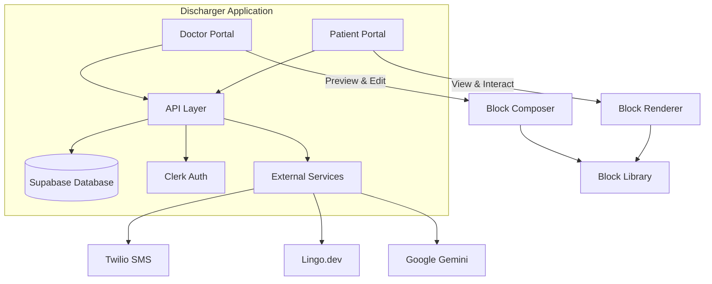
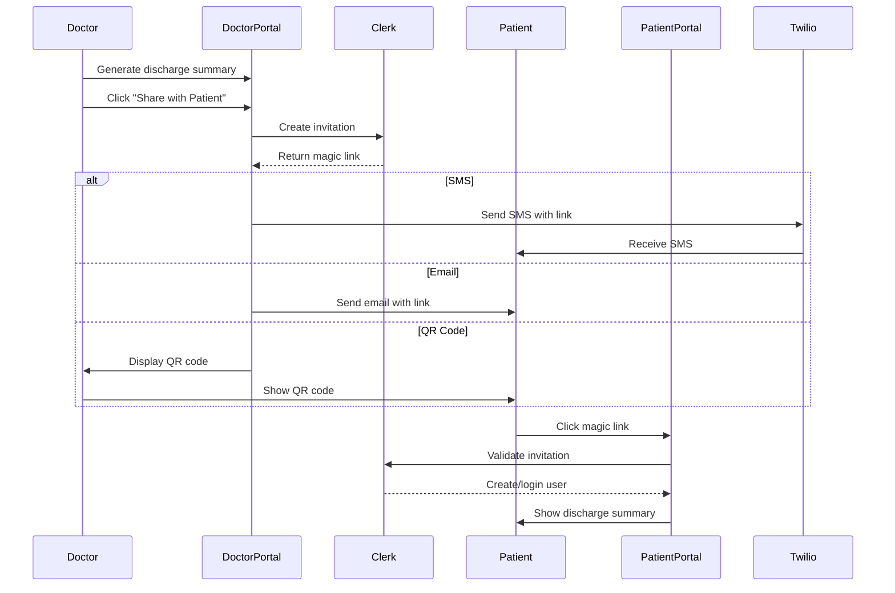
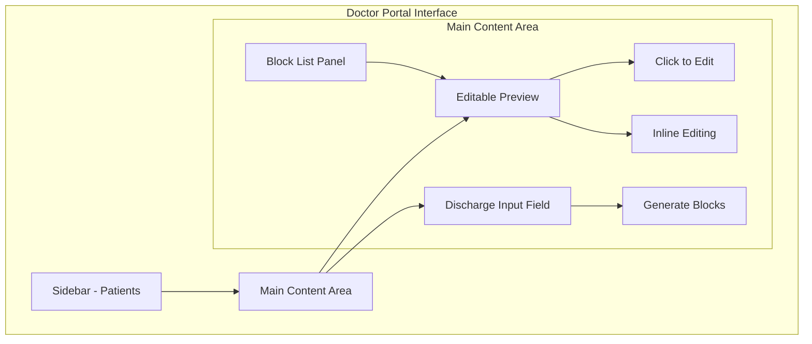

# Product Requirements Document: Patient Portal Extension for Discharger

## Executive Summary

This PRD outlines the implementation plan for extending the existing Discharger application to include a patient-facing portal. The extension will enable doctors to share simplified, interactive discharge summaries with patients via Clerks magic link authentication, providing a mobile-optimized experience for patients to track their recovery tasks, medications, and follow-up appointments.

## Product Vision

Transform complex medical discharge summaries into accessible, interactive patient guides that improve health outcomes through better patient understanding and engagement with their post-discharge care plans.

## Architecture Overview

### System Architecture



### Authentication Flow



## Block-Based Architecture

### Core Concept

The patient portal will use a **composable block system** where each section of the discharge summary is a reusable, configurable block. This allows for:
- Future extensibility to GP practices and other healthcare contexts
- Doctor customization of discharge summary layouts
- AI-assisted block composition
- Consistent UI/UX across different medical contexts

### Block Architecture


### Block Type Definitions

```typescript
export type BlockType = 'text' | 'medication' | 'task' | 'redFlag' | 'appointment';

export type BaseBlock = {
  id: string;
  type: BlockType;
  title: string;
  isEditable: boolean;
  isRequired: boolean;
  metadata: {
    createdAt: Date;
    updatedAt: Date;
    version: string;
  };
};

export type TextBlock = {
  type: 'text';
  data: {
    content: string;
    format: 'plain' | 'rich';
  };
} & BaseBlock;

export type MedicationBlock = {
  type: 'medication';
  data: {
    medications: Array<{
      id: string;
      name: string;
      dosage: string;
      frequency: string;
      duration: string;
      status: 'new' | 'changed' | 'unchanged' | 'stopped';
      instructions?: string;
    }>;
    groupBy: 'status';
  };
} & BaseBlock;

export type TaskBlock = {
  type: 'task';
  data: {
    tasks: Array<{
      id: string;
      title: string;
      description: string;
      dueDate?: Date;
      priority: 'high' | 'medium' | 'low';
      completed: boolean;
      completedAt?: Date;
    }>;
    enableReminders: boolean;
    groupBy: 'priority' | 'dueDate';
  };
} & BaseBlock;

export type RedFlagBlock = {
  type: 'redFlag';
  data: {
    symptoms: Array<{
      symptom: string;
      description: string;
    }>;
  };
} & BaseBlock;

export type AppointmentBlock = {
  type: 'appointment';
  data: {
    appointments: Array<{
      id: string;
      clinicName: string;
      description: string;
      status: 'patient_to_book' | 'clinic_will_call' | 'already_booked';
      date?: Date;
    }>;
  };
} & BaseBlock;

// Block registry for extensibility
const BlockRegistry = {
  medication: MedicationBlock,
  task: TaskBlock,
  redFlag: RedFlagBlock,
  text: TextBlock,
  appointment: AppointmentBlock,
  // Future blocks can be added here
};
```

## Database Schema

### Updated Schema with Block Architecture

```sql
-- Patient discharge summaries with Clerk integration
CREATE TABLE patient_summaries (
  id UUID PRIMARY KEY DEFAULT uuid_generate_v4(),
  patient_id UUID REFERENCES patients(id) ON DELETE CASCADE,
  doctor_id UUID REFERENCES user_profiles(id),
  
  -- Clerk invitation/user tracking
  clerk_invitation_id VARCHAR(255),
  clerk_user_id VARCHAR(255),
  patient_email VARCHAR(255),
  patient_phone VARCHAR(20),
  
  -- Block-based discharge data
  blocks JSONB NOT NULL, -- Array of block configurations
  template_id UUID REFERENCES discharge_templates(id), -- Optional template reference
  
  -- Multi-language support
  language_preference VARCHAR(10) DEFAULT 'en',
  translations JSONB DEFAULT '{}', -- Cached translations
  
  -- Tracking
  created_at TIMESTAMP WITH TIME ZONE DEFAULT NOW(),
  published_at TIMESTAMP WITH TIME ZONE,
  last_accessed_at TIMESTAMP WITH TIME ZONE,
  access_count INTEGER DEFAULT 0,
  
  -- Status
  status VARCHAR(20) DEFAULT 'draft' CHECK (status IN ('draft', 'published', 'archived')),
  shared_via VARCHAR(10) CHECK (shared_via IN ('email', 'sms', 'qr'))
);

-- Block templates for reusability
CREATE TABLE discharge_templates (
  id UUID PRIMARY KEY DEFAULT uuid_generate_v4(),
  name VARCHAR(255) NOT NULL,
  description TEXT,
  blocks JSONB NOT NULL, -- Default block configuration
  specialty VARCHAR(100), -- e.g., 'orthopedics', 'cardiology'
  is_public BOOLEAN DEFAULT false,
  created_by UUID REFERENCES user_profiles(id),
  created_at TIMESTAMP WITH TIME ZONE DEFAULT NOW()
);

-- Block presets for quick insertion
CREATE TABLE block_presets (
  id UUID PRIMARY KEY DEFAULT uuid_generate_v4(),
  block_type VARCHAR(50) NOT NULL,
  name VARCHAR(255) NOT NULL,
  configuration JSONB NOT NULL,
  tags TEXT[],
  created_by UUID REFERENCES user_profiles(id),
  is_public BOOLEAN DEFAULT false
);

-- Track block-level interactions
CREATE TABLE block_interactions (
  id UUID PRIMARY KEY DEFAULT uuid_generate_v4(),
  summary_id UUID REFERENCES patient_summaries(id) ON DELETE CASCADE,
  block_id VARCHAR(255) NOT NULL,
  interaction_type VARCHAR(50), -- 'task_completed', 'medication_viewed', etc.
  data JSONB,
  created_at TIMESTAMP WITH TIME ZONE DEFAULT NOW()
);
```

## Implementation Stages

### Stage 1: Foundation & Block System

#### 1.1 Block Architecture Implementation
- [X] Create base block interface and abstract class (`src/types/blocks.ts`)
- [ ] Implement block registry system
- [X] Build block validation framework (Zod schemas in types)
- [X] Create block rendering engine
- [X] Implement block state management (Zustand stores)

#### 1.2 Core Block Components
- [X] Build MedicationBlock component (`src/components/blocks/MedicationBlock.tsx`)
- [X] Build TaskBlock component with progress tracking (`src/components/blocks/TaskBlock.tsx`)
- [X] Build RedFlagBlock with emergency UI (`src/components/blocks/RedFlagBlock.tsx`)
- [ ] Build TextBlock with rich text support
- [X] Build AppointmentBlock with calendar integration (`src/components/blocks/AppointmentBlock.tsx`)

#### 1.3 Database Implementation
- [X] Create block-based schema tables (patient_summaries)
- [ ] Implement block versioning system
- [ ] Create template management tables
- [ ] Set up block interaction tracking
- [X] Configure RLS policies for patient access

### Stage 2: Doctor Portal Enhancements

#### 2.1 Doctor Portal Layout



Layout Structure:
```
┌─────────┬──────────────────────────────────────┬──────────────┐
│         │        Editable Preview              │              │
│ Sidebar │   ┌─────────────────────────┐       │  Block List  │
│         │   │  📋 Summary              │       │              │
│ Patients│   │  Click to edit text...   │       │  [Summary]   │
│ Settings│   ├─────────────────────────┤       │  [Tasks]     │
│         │   │  ✓ Tasks                 │       │  [Meds]      │
│         │   │  1. Follow up with GP    │       │  [Red Flags] │
│         │   │  2. Blood test Tuesday   │       │  [+ Add]     │
│         │   ├─────────────────────────┤       │              │
│         │   │  💊 Medications          │       │              │
│         │   │  • Paracetamol 500mg     │       │              │
│         │   └─────────────────────────┘       │              │
│         │                                       │              │
│         │   [Paste discharge summary below]    │              │
│         │   ┌─────────────────────────┐       │              │
│         │   │                         │       │              │
│         │   │                         │       │              │
│         │   └─────────────────────────┘       │              │
│         │   [Generate]                         │              │
└─────────┴──────────────────────────────────────┴──────────────┘
```

#### 2.2 Editable Preview Component

- [X] Create EditablePreview component with direct editing
- [X] Implement inline editing for each block type
- [ ] Add block reordering (future phase)
  - Drag handles on hover
  - Smooth animation on reorder
  - Keyboard shortcuts for moving blocks

- [ ] Create block library sidebar
  - List of available block types
  - Search/filter functionality
  - Drag to add (future)
  - Quick add buttons

#### 2.3 Discharge Input Integration

- [X] Create separate discharge input field below preview
- [X] Update LLM prompts to output block format:
  ```typescript
  interface LLMBlockOutput {
    blocks: Array<{
      type: BlockType;
      title: string;
      data: any;
    }>;
    metadata: {
      patientName?: string;
      dischargeDate?: string;
      primaryDiagnosis?: string;
    };
  }
  ```
- [X] Implement smart block generation from discharge text
- [X] Add block validation post-generation
- [ ] Create block merge logic for combining with existing blocks

#### 2.4 Interactive Editing Features

- [X] Implement direct text editing within blocks
- [ ] Add rich text editing for text blocks
- [ ] Create hover states showing editability
- [ ] Add auto-save with debouncing
- [ ] Implement undo/redo functionality

#### 2.5 Future: Mobile Preview Mode

- [X] Add toggle between "Edit Mode" and "Preview Mode"
- [X] Preview mode shows mobile-styled render
- [X] Edit mode shows current editable interface
- [X] Implement responsive preview sizing options

### Stage 3: Patient Portal Core

#### 3.1 Twilio SMS Share Patient Summary
- [ ] Configure Supabase table patient_access_keys w/ id (uuid), summary_id (id from patient_summaries, foreign key), role, phone_number, created_at, is_active
- [ ] UI for share summary, enter phone number and viewing current phone numbers with access, add and remove, enter drop-down role e.g. patient, caregiver
- [ ] API endpoint for generating access key unique to combination of summary_id and phone number and/or if exists already returning link to current ID patient summary w/ accesskey
- [ ] API Twilio endpoint for sending text messages with the unique link

#### 3.2 Block Renderer System
- [X] Create PatientLayout component
- [X] Implement block-specific patient views
- [ ] Add interaction tracking hooks
- [X] Build responsive mobile layouts
- [ ] Create offline-capable rendering

#### 3.3 Progressive Web App Setup
- [ ] Configure PWA manifest
- [ ] Implement service worker
- [ ] Add install prompt
- [ ] Create offline fallbacks
- [ ] Build update notifications

### Stage 4: Interactive Features

#### 4.1 Task Management System
- [X] Create task completion UI
- [ ] Implement progress persistence
- [ ] Add task reminders
- [ ] Build streak tracking
- [ ] Create motivational feedback

#### 4.2 Medication Tracking
- [X] Build medication checklist
- [ ] Add medication info links

#### 4.3 Multi-language Support with AI Translation
- [X] Add database schema for translations (summary_translations table)
- [X] Create translation service using LangChain + Google Gemini
- [X] Add language switcher to PatientLayout
- [X] Implement React Query hooks for translation management
- [X] Configure supported languages (10 languages)
- [X] Create LanguageSwitcher component
- [X] Implement dynamic AI-powered translation
- [X] Cache translations in database
- [X] Add cascaded deletion when blocks are updated
- [ ] Add RTL layout support
- [ ] Implement locale preferences persistence

### Stage 5: Advanced Features

#### 4.1 AI Chat Assistant
- [ ] Design chat interface within patient portal
- [ ] Create chat API with block context:
  ```typescript
  // Chat context includes all blocks
  const chatContext = {
    blocks: patientSummary.blocks,
    language: patient.language,
    completedTasks: patient.taskProgress,
    medications: patient.medications
  };
  ```
- [ ] Implement conversation memory
- [ ] Add suggested questions
- [ ] Build escalation to doctor

#### 4.2 Analytics & Tracking
- [ ] Implement PostHog for patient portal
- [ ] Track block interactions
- [ ] Monitor task completion rates
- [ ] Analyze chat usage patterns
- [ ] Create doctor dashboard for insights

### Stage 6: Polish & Optimization

#### 6.1 Performance
- [ ] Implement block lazy loading
- [ ] Add virtual scrolling for long summaries
- [ ] Optimize bundle splitting
- [ ] Create CDN strategy
- [ ] Implement aggressive caching

#### 6.2 Accessibility
- [ ] Add ARIA labels to all blocks
- [ ] Implement keyboard navigation
- [ ] Create high contrast mode
- [ ] Add screen reader support
- [ ] Build voice control options

## API Design

### Block Management APIs

```typescript
// Block template CRUD
GET    /api/block-templates
POST   /api/block-templates
PUT    /api/block-templates/:id
DELETE /api/block-templates/:id

// Block preset management
GET    /api/block-presets?type={blockType}
POST   /api/block-presets

// AI block suggestions
POST   /api/blocks/suggest
{
  context: string;
  patientInfo: PatientInfo;
  specialty?: string;
}

// Block interaction tracking
POST   /api/blocks/interactions
{
  summaryId: string;
  blockId: string;
  interactionType: string;
  data: any;
}
```

### Patient Portal APIs

```typescript
// Get patient summary with blocks
GET    /api/patient/summary/:summaryId

// Update block interaction (task completion, etc.)
POST   /api/patient/blocks/:blockId/interact

// Patient preferences
PATCH  /api/patient/preferences

// Chat with context
POST   /api/patient/chat
```

## Technical Considerations

### Block Rendering Strategy

```typescript
// Block renderer factory
const BlockRendererFactory = {
  renderBlock(block: BaseBlock, mode: 'edit' | 'preview' | 'patient') {
    const Component = BlockRegistry[block.type];
    if (!Component) {
      console.error(`Unknown block type: ${block.type}`);
      return null;
    }
    
    return (
      <Component
        block={block}
        mode={mode}
        key={block.id}
      />
    );
  }
};

// Usage in patient portal
const PatientSummaryView = ({ blocks }) => {
  return (
    <div className="space-y-4">
      {blocks
        .sort((a, b) => a.order - b.order)
        .map(block => BlockRendererFactory.renderBlock(block, 'patient'))
      }
    </div>
  );
};
```

### State Management Extension

```typescript
// Extend discharge summary store
interface DischargeSummaryStore {
  // Existing fields...
  
  // Block management
  blocks: BaseBlock[];
  selectedBlockId: string | null;
  blockTemplates: BlockTemplate[];
  
  // Actions
  addBlock: (blockType: BlockType, afterId?: string) => void;
  updateBlock: (blockId: string, updates: Partial<BaseBlock>) => void;
  removeBlock: (blockId: string) => void;
  reorderBlocks: (blockIds: string[]) => void;
  loadTemplate: (templateId: string) => void;
  saveAsTemplate: (name: string) => void;
}
```

## Security & Compliance

### Clerk Integration Security
- Use Clerk's built-in security features
- Implement invitation expiration (24 hours)
- Add rate limiting on invitation creation
- Log all invitation activities
- Enable Clerk's bot protection

### Data Protection with Blocks
- Encrypt block data at rest
- Implement field-level permissions
- Add audit trail for block modifications
- Create data retention policies per block type
- Enable HIPAA-compliant logging

## Success Metrics

### Block System Metrics
- Block type usage distribution
- Custom template creation rate
- Block modification frequency
- AI suggestion acceptance rate

### Patient Engagement Metrics
- Invitation redemption rate
- Block interaction rates by type
- Task completion percentage
- Language preference distribution
- Chat engagement per block type

## Development Guidelines

### Block Development Checklist
- [ ] Define block TypeScript interface
- [ ] Create doctor editing component
- [ ] Create patient viewing component
- [ ] Add block to registry
- [ ] Implement validation rules
- [ ] Add to block library UI
- [ ] Create preset examples
- [ ] Add translations
- [ ] Write tests
- [ ] Document usage

## Future Considerations

### Block Ecosystem
- Community block marketplace
- Third-party block development
- Block version compatibility
- Cross-institution block sharing
- Block analytics and insights

### AI Enhancement
- Smart block recommendations based on patient condition
- Auto-arrangement based on health literacy
- Predictive block content generation
- Natural language to block conversion

## Conclusion

This PRD outlines a flexible, extensible architecture for the patient portal that prioritizes reusability through a block-based system. By using Clerks invitation system for authentication and building with composable blocks, the platform can easily extend to GP practices and other healthcare contexts while maintaining a consistent, high-quality patient experience.

## Current File Structure

```
src/
├── README.md
├── api/
│   ├── blocks/
│   │   ├── hooks.ts
│   │   └── queries.ts
│   ├── discharge/
│   │   ├── hooks.ts
│   │   └── queries.ts
│   ├── documents/
│   │   ├── hooks.ts
│   │   ├── queries.ts
│   │   └── types.ts
│   ├── hospitals/
│   │   └── queries.ts
│   ├── index.ts
│   ├── patient-summaries/
│   │   ├── hooks.ts               # React Query hooks for patient summary management
│   │   ├── queries.ts             # API query functions with translation support
│   │   └── types.ts               # TypeScript types including SupportedLocale
│   ├── patients/
│   │   ├── hooks.ts
│   │   ├── queries.ts
│   │   └── types.ts
│   ├── snippets/
│   │   ├── hooks.ts
│   │   ├── queries.ts
│   │   └── types.ts
│   └── users/
│       ├── hooks.ts
│       ├── queries.ts
│       └── types.ts
├── app/
│   ├── (auth)/
│   │   ├── (center)/
│   │   │   ├── layout.tsx
│   │   │   ├── sign-in/
│   │   │   │   └── [[...sign-in]]/
│   │   │   │       └── page.tsx
│   │   │   └── sign-up/
│   │   │       └── [[...sign-up]]/
│   │   │           └── page.tsx
│   │   ├── (sidebar)/
│   │   │   ├── admin/
│   │   │   │   └── page.tsx
│   │   │   ├── composer/
│   │   │   │   └── page.tsx
│   │   │   ├── dev/
│   │   │   │   └── page.tsx
│   │   │   ├── layout.tsx
│   │   │   ├── memory/
│   │   │   │   ├── columns.tsx
│   │   │   │   └── page.tsx
│   │   │   ├── page.tsx
│   │   │   ├── profile/
│   │   │   │   └── page.tsx
│   │   │   └── snippets/
│   │   │       └── page.tsx
│   │   └── layout.tsx
│   ├── api/
│   │   ├── blocks/
│   │   │   └── generate/
│   │   │       └── route.ts
│   │   ├── dev/
│   │   │   ├── seed-hospitals/
│   │   │   │   └── route.ts
│   │   │   └── seed-user-data/
│   │   │       └── route.ts
│   │   ├── discharge/
│   │   │   └── route.ts
│   │   ├── documents/
│   │   │   ├── [id]/
│   │   │   │   ├── route.ts
│   │   │   │   └── signed-url/
│   │   │   │       └── route.ts
│   │   │   └── route.ts
│   │   ├── hospitals/
│   │   │   └── route.ts
│   │   ├── patient-summaries/
│   │   │   ├── [id]/
│   │   │   │   ├── blocks/
│   │   │   │   │   └── route.ts        # Update patient summary blocks
│   │   │   │   ├── locale/
│   │   │   │   │   └── route.ts        # Update locale preference
│   │   │   │   ├── route.ts            # Get/update single patient summary
│   │   │   │   ├── translate/
│   │   │   │   │   └── route.ts        # Create new AI translation
│   │   │   │   └── translations/
│   │   │   │       ├── [locale]/
│   │   │   │       │   └── route.ts    # Get specific translation
│   │   │   │       └── route.ts        # List all translations
│   │   │   └── route.ts                # List/create patient summaries
│   │   ├── patients/
│   │   │   ├── [id]/
│   │   │   │   └── route.ts
│   │   │   ├── cleanup/
│   │   │   │   └── route.ts
│   │   │   └── route.ts
│   │   ├── snippets/
│   │   │   ├── [id]/
│   │   │   │   └── route.ts
│   │   │   ├── route.ts
│   │   │   └── shortcut/
│   │   │       └── [shortcut]/
│   │   │           └── route.ts
│   │   ├── users/
│   │   │   ├── preferences/
│   │   │   │   └── route.ts
│   │   │   └── profile/
│   │   │       └── route.ts
│   │   └── webhooks/
│   │       └── clerk/
│   │           └── route.ts
│   ├── docs/
│   │   ├── PRD.md
│   │   ├── block-generation-implementation-plan.md
│   │   ├── deployment-readiness-plan.md
│   │   ├── discharge-implementation-plan.md
│   │   ├── informal-PRD.md
│   │   ├── lingo-dev-implementation-guide.md
│   │   ├── onborda-implementation-guide.md
│   │   ├── patient-lifecycle-refactor.md
│   │   ├── patient-portal-implementation-plan.md
│   │   └── patient-simplifier.md
│   ├── global-error.tsx
│   ├── layout.tsx
│   ├── patient/
│   │   ├── [summaryId]/
│   │   │   └── page.tsx
│   │   └── layout.tsx
│   ├── robots.ts
│   └── sitemap.ts
├── components/
│   ├── AutoSaveIndicator.tsx
│   ├── ContextViewer/
│   │   ├── ContextViewer.tsx
│   │   ├── ContextViewerHeader.tsx
│   │   ├── DocumentListPanel.tsx
│   │   ├── UserContextPanel.tsx
│   │   └── index.ts
│   ├── DataTable.tsx
│   ├── DevicePreviewer/
│   │   ├── DevicePreview.tsx
│   │   ├── device-styles.module.css
│   │   ├── iPhone14Frame.tsx
│   │   └── index.ts
│   ├── DischargeSummary.tsx
│   ├── DischargeSummary/
│   │   ├── DischargeSummaryContent.tsx
│   │   ├── DischargeSummaryHeader.tsx
│   │   ├── DischargeSummaryPanel.tsx
│   │   ├── DischargeSummarySection.tsx
│   │   ├── FeedbackInput.tsx
│   │   └── index.ts
│   ├── DocumentPreviewModal.tsx
│   ├── DocumentSelector.tsx
│   ├── LanguageSwitcher.tsx          # Language switcher component with flag icons
│   ├── PatientForm.tsx
│   ├── PatientSimplified/
│   │   ├── FloatingChat.tsx
│   │   ├── PatientLayout.tsx         # Main patient portal layout with translation integration
│   │   └── index.ts
│   ├── Sidebar.tsx
│   ├── SnippetSelector.tsx
│   ├── TourProvider.tsx
│   ├── analytics/
│   │   ├── PostHogPageView.tsx
│   │   └── PostHogProvider.tsx
│   ├── blocks/
│   │   ├── AppointmentBlock.tsx
│   │   ├── MedicationBlock.tsx
│   │   ├── RedFlagBlock.tsx
│   │   └── TaskBlock.tsx
│   ├── query/
│   │   └── ReactQueryClientProvider.tsx
│   └── ui/
│       ├── ... (shadcn/ui components)
├── context/
│   └── PatientContext.tsx
├── hooks/
│   ├── useAutoSave.ts
│   ├── useNewPatient.ts
│   ├── useOnboarding.ts
│   └── usePatientCleanup.ts
├── instrumentation.ts
├── libs/
│   ├── Arcjet.ts
│   ├── DB.ts
│   ├── Env.ts
│   ├── Logger.ts
│   ├── documentProcessor.ts
│   ├── onboarding-steps.ts
│   ├── supabase-client.ts
│   ├── supabase-server.ts
│   ├── utils.ts
│   └── vectorStore.ts
├── locales/
│   └── en.json
├── middleware.ts
├── models/
│   └── Schema.ts
├── scripts/
│   └── seed-hospitals.ts
├── stores/
│   ├── dischargeSummaryStore.ts
│   ├── index.ts
│   ├── patientStore.ts
│   └── uiStore.ts
├── styles/
│   └── global.css
├── templates/
│   └── BaseTemplate.tsx
├── types/
│   ├── blocks.ts
│   ├── discharge.ts
│   ├── files.ts
│   └── index.ts
└── utils/
    ├── AppConfig.ts
    ├── Helpers.ts
    └── debounce.ts
```


### Multi-Language System Architecture

The language switching system consists of several interconnected components:

1. **API Layer (`src/api/patient-summaries/`)**: 
   - `types.ts` defines `SupportedLocale` type for the 10 supported languages
   - `queries.ts` contains API functions for translation management
   - `hooks.ts` provides React Query hooks for translation state management

2. **UI Components**:
   - `LanguageSwitcher.tsx` provides a dropdown with flag icons and language names
   - `PatientLayout.tsx` integrates the language switcher and manages translation state

3. **API Routes (`src/app/api/patient-summaries/[id]/`)**: 
   - `translate/route.ts` creates AI-powered translations using Google Gemini
   - `translations/route.ts` and `translations/[locale]/route.ts` manage stored translations
   - `locale/route.ts` updates user locale preferences

4. **Data Flow**:
   - User selects language in `LanguageSwitcher`
   - `PatientLayout` calls translation hooks from `src/api/patient-summaries/hooks.ts`
   - If translation doesn't exist, AI creates it via `/translate` endpoint
   - Translated blocks are cached and displayed to user
   - React Query manages caching and invalidation of translation data


⏺ Comprehensive Implementation Plan: Patient Summary Sharing with SMS

  Overview

  I'll create a feature that allows doctors to share patient summaries with patients and caregivers via SMS. This involves
  creating a secure access key system, SMS integration with Twilio, and a comprehensive UI for managing access.

  Database Schema Changes

  1. New Table: patient_access_keys

  - id (UUID, Primary Key)
  - summary_id (UUID, Foreign Key to patient_summaries)
  - role (TEXT: 'patient' | 'caregiver')
  - phone_number (TEXT, E.164 format)
  - access_key (TEXT, unique 64-char hex string)
  - is_active (BOOLEAN, default true)
  - created_at (TIMESTAMP WITH TIME ZONE)
  - updated_at (TIMESTAMP WITH TIME ZONE)

  Key Features:
  - Unique constraint on (summary_id, phone_number) where is_active = true
  - RLS policies for doctor access and public access via access_key
  - Auto-generated secure access keys using gen_random_bytes(32)

  API Endpoints

  2. Access Key Management API

  /api/patient-summaries/[summaryId]/access-keys
  - GET: List all access keys for a summary
  - POST: Create or retrieve existing access key for phone/role combination
  - DELETE: Deactivate access key

  /api/patient-summaries/[summaryId]/share-sms
  - POST: Send SMS with access link to phone number

  3. Public Access API

  /api/patient-summaries/access/[accessKey]
  - GET: Retrieve patient summary via access key (bypasses authentication)

  UI Components

  4. Share Dialog Component (SharePatientSummaryDialog)

  Location: src/components/SharePatientSummaryDialog.tsx
  - Modal triggered by "Share with Patient" button
  - Phone number input with international format validation
  - Role selector (Patient/Caregiver) using Badge components
  - Send SMS button with loading states
  - Success/error feedback with toast notifications

  5. Access Management Panel (AccessManagementPanel)

  Location: src/components/AccessManagementPanel.tsx
  - Table showing current active access keys
  - Columns: Phone Number, Role, Created Date, Actions
  - Remove access functionality
  - Real-time updates using React Query

  6. Enhanced Composer Page

  - Integrate SharePatientSummaryDialog into existing "Share with Patient" button
  - Add access management panel (collapsible section)
  - Conditional rendering based on summary existence

  React Query Integration

  7. API Hooks

  Location: src/api/patient-access-keys/
  - usePatientAccessKeys(summaryId) - Fetch access keys
  - useCreateAccessKey() - Create new access key
  - useDeactivateAccessKey() - Remove access
  - useSendSMS() - Send SMS with link

  Location: src/api/patient-summaries/
  - usePublicPatientSummary(accessKey) - Public access endpoint

  Security & Validation

  8. Security Measures

  - Access keys: 64-character cryptographically secure random strings
  - Phone number validation using libphonenumber-js
  - Rate limiting on SMS sending (Arcjet integration)
  - RLS policies preventing unauthorized access
  - Access key expiration (optional future enhancement)

  9. Validation Schemas

  Location: src/models/Schema.ts
  - Zod schemas for phone number validation
  - Role enum validation
  - Access key format validation

  SMS Integration

  10. Twilio Service

  Location: src/libs/twilio.ts
  - Twilio client initialization with environment variables
  - SMS sending function with error handling
  - Message template for patient access links
  - Australian phone number format handling

  User Experience Flow

  11. Doctor Workflow

  1. Doctor completes patient summary in composer
  2. Clicks "Share with Patient" button
  3. Modal opens with phone number input and role selection
  4. Doctor enters phone number, selects role (Patient/Caregiver)
  5. Clicks "Send SMS" - system either:
    - Creates new access key and sends SMS, OR
    - Finds existing access key and sends SMS with existing link
  6. Success notification shows
  7. Doctor can view/manage all access keys in expandable panel

  12. Patient/Caregiver Workflow

  1. Receives SMS with unique link
  2. Clicks link → redirects to /patient/[summaryId]?access=[accessKey]
  3. System validates access key and displays patient summary
  4. Full patient portal functionality available (view blocks, complete tasks, etc.)

  Technical Implementation Details

  13. Environment Variables

  - NEXT_TWILIO_ACCOUNT_SID (already configured)
  - NEXT_TWILIO_AUTH_TOKEN (already configured)
  - NEXT_TWILIO_PHONE_NUMBER (new - the Australian number you purchased)

  14. Link Generation

  - Format: ${baseUrl}/patient/${summaryId}?access=${accessKey}
  - Access key validation in patient portal layout
  - Fallback to existing Clerk authentication if no access key

  15. Error Handling

  - Invalid phone numbers
  - Twilio API failures
  - Duplicate access key scenarios
  - Network timeout handling
  - User-friendly error messages

  File Structure Changes

  src/
  ├── api/
  │   └── patient-access-keys/
  │       ├── hooks.ts       # React Query hooks
  │       ├── queries.ts     # API query functions
  │       └── types.ts       # TypeScript types
  ├── app/api/
  │   ├── patient-summaries/[id]/
  │   │   ├── access-keys/
  │   │   │   └── route.ts   # Access key CRUD
  │   │   └── share-sms/
  │   │       └── route.ts   # SMS sending
  │   └── patient-summaries/access/[accessKey]/
  │       └── route.ts       # Public access endpoint
  ├── components/
  │   ├── SharePatientSummaryDialog.tsx
  │   └── AccessManagementPanel.tsx
  ├── libs/
  │   └── twilio.ts          # Twilio service
  └── models/
      └── Schema.ts          # Updated with access key schemas

  Next Steps After Approval

  1. Database Migration - Create patient_access_keys table
  2. Twilio Service - Implement SMS sending functionality
  3. API Endpoints - Create access key and SMS endpoints
  4. UI Components - Build share dialog and access management
  5. Integration - Connect everything in composer page
  6. Testing - Test with real phone numbers
  7. Error Handling - Comprehensive error scenarios

  This plan provides a complete, secure, and user-friendly patient sharing system that integrates seamlessly with the existing
  codebase architecture and follows established patterns for state management, API design, and UI components.

## 🚀 IMPLEMENTATION STATUS - SMS SHARING SYSTEM

### ✅ Completed Implementation (as of 2025-01-07)

#### 1. Database Schema Implementation
**Status: COMPLETED**
- ✅ Created `patient_access_keys` table via Supabase migration
- ✅ Added proper RLS policies for doctor access
- ✅ Implemented unique constraints on (summary_id, phone_number) for active keys
- ✅ Auto-generated 64-character secure access keys using `gen_random_bytes(32)`
- ✅ Added proper indexes for performance

**Migration Applied:**
```sql
-- Create patient_access_keys table for sharing patient summaries via SMS
CREATE TABLE patient_access_keys (
  id UUID PRIMARY KEY DEFAULT uuid_generate_v4(),
  summary_id UUID REFERENCES patient_summaries(id) ON DELETE CASCADE,
  role TEXT NOT NULL CHECK (role IN ('patient', 'caregiver')),
  phone_number TEXT NOT NULL,
  access_key TEXT NOT NULL UNIQUE DEFAULT encode(gen_random_bytes(32), 'hex'),
  is_active BOOLEAN NOT NULL DEFAULT true,
  created_at TIMESTAMP WITH TIME ZONE DEFAULT NOW(),
  updated_at TIMESTAMP WITH TIME ZONE DEFAULT NOW()
);
```

#### 2. SMS Service Implementation
**Status: COMPLETED**
- ✅ Created Twilio service (`src/libs/twilio.ts`)
- ✅ Phone number validation using `libphonenumber-js`
- ✅ E.164 format handling for international numbers
- ✅ SMS message templates for patient access links
- ✅ Error handling and logging
- ✅ Support for Australian phone number format

**File: `src/libs/twilio.ts`**
- TwilioService class with SMS sending capabilities
- Phone number validation and formatting
- Custom message templates for patient/caregiver access
- Environment variable configuration support

#### 3. API Endpoints Implementation
**Status: COMPLETED - All Core Endpoints**

**Access Key Management:**
- ✅ `GET /api/patient-summaries/[id]/access-keys` - List access keys
- ✅ `POST /api/patient-summaries/[id]/access-keys` - Create/retrieve access key

**SMS Sending:**
- ✅ `POST /api/patient-summaries/[id]/share-sms` - Send SMS with access link

**Public Access:**
- ✅ `GET /api/patient-summaries/access/[accessKey]` - Public patient summary access

**Translation Support (with dual auth):**
- ✅ `POST /api/patient-summaries/[id]/translate` - Create translations (dual auth)
- ✅ `GET /api/patient-summaries/[id]/translations` - List translations (dual auth)
- ✅ `GET /api/patient-summaries/[id]/translations/[locale]` - Get specific translation (dual auth)

#### 4. Security Implementation
**Status: COMPLETED - Dual Authentication System**

**Dual Authentication Pattern Implemented:**
```typescript
// Secure pattern for public endpoints
let user = null;
try {
  user = await currentUser(); // Clerk auth
} catch (error) {
  // Clerk not available (public route)
}

if (user) {
  // Standard Clerk authentication
  const userHasAccess = summary.doctor_id === user.id || summary.patient_user_id === user.id;
} else if (accessKey) {
  // Access key validation
  const { data: accessKeyData } = await supabase
    .from('patient_access_keys')
    .select('summary_id, is_active')
    .eq('access_key', accessKey)
    .eq('summary_id', patientSummaryId)
    .eq('is_active', true)
    .single();
}
```

**Security Features:**
- ✅ Cryptographically secure access keys (64-character hex)
- ✅ Phone number validation and E.164 formatting
- ✅ RLS policies for data isolation
- ✅ Dual authentication (Clerk + access key)
- ✅ Proper error handling and access logging

#### 5. Frontend Implementation
**Status: COMPLETED - Full UI Components**

**SharePatientSummaryDialog Component:**
- ✅ Location: `src/components/SharePatientSummaryDialog.tsx`
- ✅ Phone number input with validation
- ✅ Role selector (Patient/Caregiver) with Badge UI
- ✅ SMS sending with loading states
- ✅ Toast notifications for success/error feedback
- ✅ React Hook Form + Zod validation

**AccessManagementPanel Component:**
- ✅ Location: `src/components/AccessManagementPanel.tsx`
- ✅ Collapsible panel showing active access keys
- ✅ Table with phone numbers, roles, creation dates
- ✅ Remove access functionality
- ✅ Real-time updates via React Query
- ✅ Empty state handling

**Composer Page Integration:**
- ✅ Updated `src/app/(auth)/(sidebar)/composer/page.tsx`
- ✅ Integrated SharePatientSummaryDialog with existing "Share with Patient" button
- ✅ Added AccessManagementPanel to sidebar
- ✅ Conditional rendering based on summary existence

#### 6. Patient Portal Updates
**Status: COMPLETED - Access Key Authentication**

**Enhanced Patient Portal:**
- ✅ Updated `src/app/patient/[summaryId]/page.tsx`
- ✅ Access key extraction from URL parameters (`?access=...`)
- ✅ Public API integration for summary fetching
- ✅ Loading and error state handling
- ✅ Translation support with access key authentication

**Translation System with Dual Auth:**
- ✅ Updated `src/components/PatientSimplified/PatientLayout.tsx`
- ✅ Access key passing to translation hooks
- ✅ Secure translation creation and retrieval
- ✅ Language switcher functionality maintained

#### 7. React Query Integration
**Status: COMPLETED - Full API Layer**

**API Layer Structure:**
```
src/api/patient-access-keys/
├── hooks.ts        # React Query hooks
├── queries.ts      # API query functions  
└── types.ts        # TypeScript types
```

**Implemented Hooks:**
- ✅ `usePatientAccessKeys(summaryId)` - Fetch access keys
- ✅ `useCreateAccessKey()` - Create new access key
- ✅ `useDeactivateAccessKey()` - Remove access
- ✅ `useSendPatientAccessSMS()` - Send SMS with link
- ✅ `usePublicPatientSummary(accessKey)` - Public access

#### 8. Middleware Configuration
**Status: COMPLETED - Public Routes Security**

**Updated Middleware:**
- ✅ File: `src/middleware.ts`
- ✅ Public route patterns for patient access:
  - `/patient(.*)` - Public patient portal
  - `/api/patient-summaries/access/(.*)` - Public summary access
  - `/api/patient-summaries/(.*)/translate` - Public translation creation
  - `/api/patient-summaries/(.*)/translations` - Public translation listing
  - `/api/patient-summaries/(.*)/translations/(.*)` - Public translation access

#### 9. Type Safety & Validation
**Status: COMPLETED - End-to-End TypeScript**

**Type Definitions:**
- ✅ `PatientAccessKey` interface
- ✅ `CreateAccessKeyRequest/Response` types
- ✅ `SendSMSRequest/Response` types
- ✅ Updated `TranslateRequest` with optional `access_key`
- ✅ Zod schemas for validation

### 🔧 Current Authentication Architecture

#### Standard Authenticated Routes (Doctors/Staff)
```
User → Clerk Auth → Middleware → API → Supabase (with RLS)
```

#### Public Patient Access Routes
```
Patient → SMS Link → Access Key → Public API → Supabase (Service Role/Dual Auth)
```

#### Dual Authentication Endpoints
These endpoints support BOTH authentication methods:
- `/api/patient-summaries/[id]/translate`
- `/api/patient-summaries/[id]/translations`
- `/api/patient-summaries/[id]/translations/[locale]`

### ✅ RESOLVED - Security Refactoring Complete (2025-01-07)

#### 1. Unified Authentication Pattern - IMPLEMENTED
**Solution:** Replaced dual-client pattern with unified hooks and RLS-based security:

```typescript
// Unified Pattern - Single hook for both auth methods
const { data: summary } = usePatientSummary(summaryId, { 
  accessKey: patientAccessKey 
});

// JWT-based Access Key Authentication  
const customJWT = jwt.sign({
  sub: 'access_key_user',
  role: 'anon', 
  access_key: accessKey,
  exp: Math.floor(Date.now() / 1000) + (60 * 60 * 24 * 90) // 3 months
}, process.env.SUPABASE_JWT_SECRET!);
```

**RLS Policies Implemented:**
```sql
-- Access via Clerk auth OR valid access key
CREATE POLICY "Access via access key" ON patient_summaries
FOR SELECT USING (
  EXISTS (
    SELECT 1 FROM patient_access_keys
    WHERE patient_access_keys.summary_id = patient_summaries.id
    AND patient_access_keys.access_key = (auth.jwt() ->> 'access_key')
    AND patient_access_keys.is_active = true
  )
);
```

#### 2. Eliminated Service Role Security Risk - RESOLVED
**Implementation:** 
- ✅ Created dedicated `createAccessKeySupabaseClient()` with custom JWT
- ✅ Removed all service role usage from patient access endpoints
- ✅ Database-level access control via RLS policies
- ✅ 3-month JWT tokens for patient convenience

#### 3. Clean API Architecture - IMPLEMENTED
**New Structure:**
```
/api/patient-summaries/[id]/summary    # Unified summary access (public)
/api/patient-summaries/[id]/translate  # Unified translation (public)  
/api/patient-summaries/[id]/access-keys # Access key management (protected)
```

**Middleware Patterns:**
```typescript
const isPublicRoute = createRouteMatcher([
  '/patient(.*)',
  '/api/patient-summaries/:id/summary',
  '/api/patient-summaries/:id/translate', 
  '/api/patient-summaries/:id/translations',
  '/api/patient-summaries/:id/translations/:locale',
]);
```

### 📁 Files Modified/Created

#### New Files Created:
```
src/libs/twilio.ts
src/api/patient-access-keys/
├── hooks.ts
├── queries.ts
└── types.ts
src/components/SharePatientSummaryDialog.tsx
src/components/AccessManagementPanel.tsx
src/app/api/patient-summaries/[id]/access-keys/route.ts
src/app/api/patient-summaries/[id]/share-sms/route.ts
src/app/api/patient-summaries/access/[accessKey]/route.ts
```

#### Modified Files:
```
src/middleware.ts                                           # Updated to use :id patterns
src/app/(auth)/(sidebar)/composer/page.tsx                # Integrated sharing UI
src/app/patient/[summaryId]/page.tsx                      # Updated to unified pattern
src/components/PatientSimplified/PatientLayout.tsx        # Unified hook usage
src/api/patient-summaries/hooks.ts                        # Unified pattern with access key support
src/api/patient-summaries/queries.ts                      # Updated endpoints (/summary)
src/api/patient-summaries/types.ts                        # Added access_key to TranslateRequest
src/app/api/patient-summaries/[id]/summary/route.ts       # Moved from [id]/route.ts
src/app/api/patient-summaries/[id]/translate/route.ts     # Access key authentication
src/app/api/patient-summaries/[id]/translations/route.ts  # Access key authentication  
src/app/api/patient-summaries/[id]/translations/[locale]/route.ts # Access key authentication
```

### 🎯 **Key Features Delivered**

#### **🔐 Secure Patient Access System**
- **SMS Sharing**: Doctors send secure links via SMS with 3-month access keys
- **Access Management**: UI to create, view, and revoke patient/caregiver access
- **RLS Security**: Database-level access control, no service role exposure
- **Multi-Role Support**: Separate access for patients vs caregivers

#### **🌍 AI-Powered Translation System** 
- **10 Languages Supported**: Auto-translation using Google Gemini 2.0 Flash
- **Smart Caching**: Translations cached in database, deleted when content changes
- **Access Key Compatible**: Patients can translate summaries via SMS links
- **Real-time UI**: Language switcher with flag icons and smooth loading states

#### **🔄 Unified API Architecture**
- **Single Hook Pattern**: `usePatientSummary(id, { accessKey })` supports both auth methods
- **Clean Endpoints**: `/summary`, `/translate`, `/translations` with proper security boundaries
- **Smart Cache Keys**: Separate cache entries for different authentication methods
- **Surgical Invalidation**: Only invalidate specific patient's cache, not all patients

### 🛡️ **Smart Middleware Implementation**

**Dynamic Route Protection**: Middleware detects `access_key` parameter and conditionally makes routes public:

```typescript
// Doctor request (no access_key) → Protected → Clerk auth runs ✅
GET /api/patient-summaries/123/translations

// Patient request (with access_key) → Public → Access key auth ✅  
GET /api/patient-summaries/123/translations?access_key=abc123
```

**Benefits**: Eliminates 401 errors for doctors while maintaining security for public patient access.
